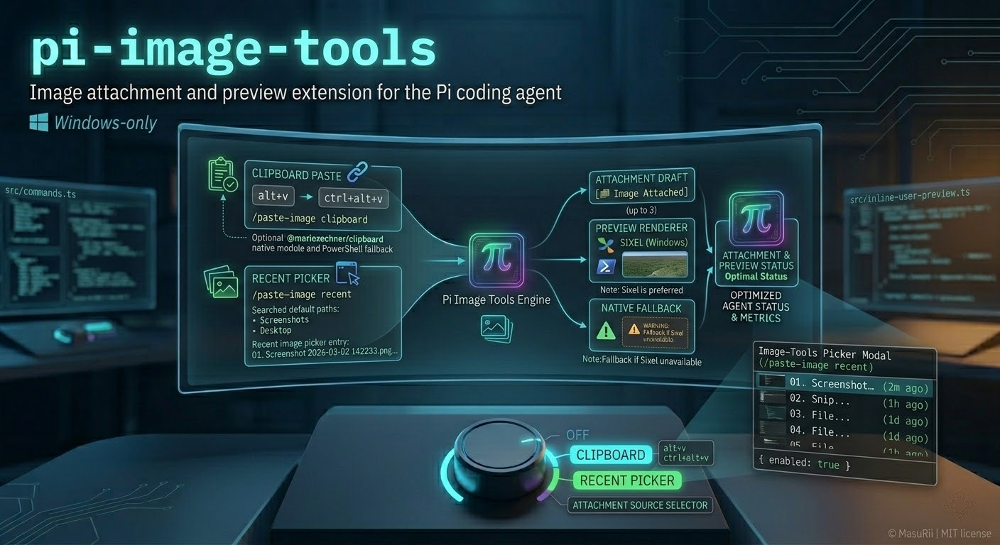

# pi-image-tools

Image attachment and preview extension for the **Pi coding agent**.

This extension focuses on one workflow: quickly attach a clipboard image (or pick a recent screenshot) to the message you are about to send, and then render an inline preview in the TUI chat.

> **Windows-only:** `pi-image-tools` only registers commands/shortcuts on Windows (`win32`). On macOS/Linux it does nothing.



## Features

- Paste images into your next message:
  - `/paste-image clipboard` (default) reads an image from the clipboard and queues it for the next send.
  - `/paste-image recent` opens a picker for recent screenshots/images and queues the selected file.
- Keyboard shortcuts for fast paste:
  - `alt+v`
  - `ctrl+alt+v`
- Inline image preview in the chat after you send your message (up to **3** images previewed per message).
- Recent-images support:
  - Searches common Windows screenshot locations by default.
  - Caches images you pasted from clipboard so they also show up in the recent picker.
- Preview modes:
  - **Sixel** (preferred on Windows) when the PowerShell `Sixel` module is available.
  - **Native** fallback rendering when Sixel conversion is unavailable.

## Installation

### Local extension folder

Place this folder in:

- Global: `~/.pi/agent/extensions/pi-image-tools`
- Project: `.pi/extensions/pi-image-tools`

Pi auto-discovers these paths.

### As an npm package

```bash
pi install npm:pi-image-tools
```

Or from git:

```bash
pi install git:github.com/MasuRii/pi-image-tools
```

## Usage

### Paste from clipboard

Command:

```text
/paste-image clipboard
```

Notes:

- `/paste-image` (with no args) behaves the same as `/paste-image clipboard`.
- The extension inserts a marker into your draft (`[󰈟 Image Attached]`). When you send, that marker is removed and the queued image(s) are attached to the outgoing message.
- If you remove all markers from your draft before sending, the pending queued images are discarded.

### Paste from recent images

```text
/paste-image recent
```

This opens an interactive picker (requires Pi’s interactive TUI mode). The extension searches for recent images and shows a list like:

```text
01. Screenshot 2026-03-02 142233.png • 2m ago • 412 KB • C:\Users\...\Pictures\Screenshots\...
```

After selection, the image is queued for your next send.

### Shortcuts

These shortcuts are equivalent to `/paste-image clipboard`:

- `alt+v`
- `ctrl+alt+v`

## Recent images: what gets searched

`/paste-image recent` searches Windows paths in this order:

1. The **recent cache directory** (images you pasted via clipboard are cached here).
2. If configured via environment, the directories from `PI_IMAGE_TOOLS_RECENT_DIRS`.
3. Otherwise, these defaults:
   - `~/Pictures/Screenshots`
   - `~/OneDrive/Pictures/Screenshots`
   - `~/Desktop` (only files with screenshot-like names such as `Screenshot*`, `Snip*`, `IMG_*`, etc.)

Supported file types: `.png`, `.jpg`/`.jpeg`, `.webp`, `.gif`, `.bmp`.

### Environment variables

- `PI_IMAGE_TOOLS_RECENT_DIRS`
  - Semicolon-separated list of directories to search (Windows-style):
    - Example: `C:\Users\you\Pictures\Screenshots;D:\Shares\Screens`
- `PI_IMAGE_TOOLS_RECENT_CACHE_DIR`
  - Overrides where clipboard-pasted images are cached.
  - Default: `%TEMP%\pi-image-tools\recent-cache`

## Preview rendering (native vs Sixel)

When Pi displays a user message that contains image attachments, `pi-image-tools` renders an inline preview block under the message.

- **Sixel preview (Windows):**
  - The extension tries to detect (and, if missing, install) the PowerShell module `Sixel` under the current user.
  - It then converts the image to a Sixel escape sequence via PowerShell and renders it inline.
- **Native preview fallback:**
  - If Sixel is unavailable or conversion fails, the extension renders via `@mariozechner/pi-tui`’s `Image` component.
  - When a fallback is used, a warning line may be shown under the preview (and a one-time warning notification can appear on session start).

Limit: only the first **3** images in a message are previewed.

## Dependencies / PowerShell notes

### Clipboard access

- **Optional native module:** `@mariozechner/clipboard` (declared as an optional dependency).
  - If it is available, `pi-image-tools` uses it first.
- **PowerShell fallback (Windows):** if the native module is unavailable, the extension calls `powershell.exe` to read an image from the clipboard using .NET (`System.Windows.Forms.Clipboard`).

### Sixel module

- Sixel preview uses the **PowerShell module** `Sixel`.
- `pi-image-tools` attempts to install it automatically (CurrentUser scope) using either `Install-Module` or `Install-PSResource` (depending on what your PowerShell supports).

If your environment blocks module installation, you can install it manually (in a PowerShell prompt):

```powershell
Install-Module -Name Sixel -Scope CurrentUser -Force -AllowClobber
```

## Configuration

Runtime config is stored at:

```text
~/.pi/agent/extensions/pi-image-tools/config.json
```

A starter file is included as:

```text
config/config.example.json
```

Currently the template only contains:

```json
{ "enabled": true }
```

## Troubleshooting

### Nothing happens on `/paste-image` or shortcuts

- This extension is **Windows-only**. On non-Windows platforms it does not register `/paste-image`.

### “/paste-image recent requires interactive TUI mode.”

- The recent picker uses an interactive selection UI. Run Pi in interactive mode (TUI) and retry.

### “No image found in clipboard.”

- Confirm you copied an actual image (not just a file path or text).
- If clipboard reads are failing in general, PowerShell may be restricted by policy or your environment may not allow access to `System.Windows.Forms.Clipboard`.

### Recent picker is empty

- By default only a few directories are searched. Configure additional directories via `PI_IMAGE_TOOLS_RECENT_DIRS`.
- Clipboard-pasted images are cached under `%TEMP%\pi-image-tools\recent-cache` (override with `PI_IMAGE_TOOLS_RECENT_CACHE_DIR`).

### Preview shows a warning about Sixel

- The extension falls back to native preview when the `Sixel` PowerShell module is missing or cannot be installed.
- Install the module manually (see above) and restart Pi.

## Development

```bash
npm run build
npm run lint
npm run test
npm run check
```

## Project layout

- `index.ts` - root Pi auto-discovery entrypoint
- `src/commands.ts` - `/paste-image` command registration and argument handling
- `src/keybindings.ts` - `alt+v` / `ctrl+alt+v` shortcut registration
- `src/clipboard.ts` - clipboard image read (optional native module + PowerShell fallback)
- `src/recent-images.ts` - recent discovery + cache management (`PI_IMAGE_TOOLS_RECENT_DIRS`, `PI_IMAGE_TOOLS_RECENT_CACHE_DIR`)
- `src/image-preview.ts` - preview item building, Sixel conversion, and message renderer
- `src/inline-user-preview.ts` - patches Pi TUI message rendering to show inline previews

## License

MIT
